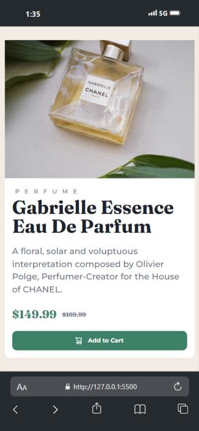

# Frontend Mentor - Product preview card component solution

This is a solution to the [Product preview card component challenge on Frontend Mentor](https://www.frontendmentor.io/challenges/product-preview-card-component-GO7UmttRfa). Frontend Mentor challenges help you improve your coding skills by building realistic projects.

## Table of contents

- [Frontend Mentor - Product preview card component solution](#frontend-mentor---product-preview-card-component-solution)
  - [Table of contents](#table-of-contents)
  - [Overview](#overview)
    - [The challenge](#the-challenge)
    - [Screenshot](#screenshot)
      - [Macbook](#macbook)
      - [Mobile](#mobile)
    - [Links](#links)
  - [My process](#my-process)
    - [Built with](#built-with)
    - [What I learned](#what-i-learned)
    - [Continued development](#continued-development)
    - [Useful resources](#useful-resources)
  - [Author](#author)

## Overview

### The challenge

Users should be able to:

- View the optimal layout depending on their device's screen size
- See hover and focus states for interactive elements

### Screenshot

#### Macbook


#### Mobile



### Links

- Solution URL: [Frontend Mentor](https://www.frontendmentor.io/solutions/product-view-card-using-html-and-css-HTVdJ22qYh)
- Live Site URL: [Webpage](https://ekondongayecaba.github.io/product-view-card/)

## My process

### Built with

- Semantic HTML5 markup
- CSS custom properties
- Flexbox
- CSS Grid
- Mobile-first workflow

### What I learned

The most important think I learnt was how to change an image in function of a screen size

I had to put a void div first

```html
<div class="product__img"></div>
```

And then I put the image as a background and that allowed me to change it using CSS

```css
.product__img {
  background-image: url("./images/image-product-mobile.jpg");
  background-size: cover;
  width: 100%;
  height: 40vh;
}

@media screen and (min-width: 768px) {
  .product__img {
    background-image: url("./images/image-product-desktop.jpg");
    height: 100%;
  }
}
```

### Continued development

I want to keep learning about using functions as ´clamp()´ who allow us to have a font-size who grow automatically

### Useful resources

- [web.dev](https://web.dev/learn/design/typography?hl=es-419) - This helped me for knowing about the clamp function.

## Author

- Frontend Mentor - [@Eko Ndong Ayecaba](https://www.frontendmentor.io/profile/EkoNdongAyecaba)
- Twitter - [@ko Ndong Ayecaba](https://x.com/Shiitake_EGBM)
